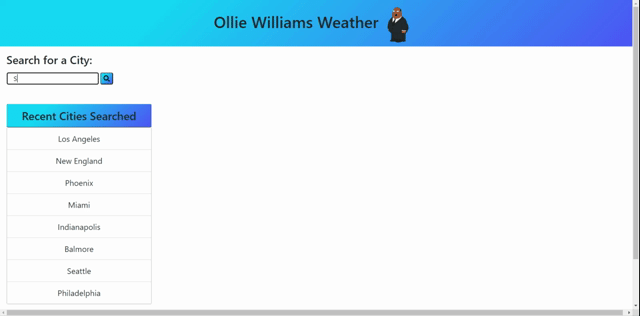

#  Ollie Williams Weather (https://smithbware89.github.io/ollie-williams-weather/)

## Description
**Update**: This project has been update to showcase skills that I've learned. I've updated this project to use AngularJs (v17), Tailwind CSS, RxJS, and an Express server to serve the final build of the application on Heroku. In order to protect the API key, I've developed a backend that's also deployed on Heroku as a proxy server for my requests to the OpenWeather API.

This particular project is an ode to one of my favorite Family Guy characters, Ollie Williams. If you weren't aware, Ollie Williams is a meteorologist on the fictional hit television show "Family Guy." He provides a quick bit of comic relief that always amused me so when this project came up in my boot camp there was only one name that came to mind - Ollie. I hope that you enjoy this app, it's functionality, and the useful bits of information that it provides for you. I'm still very new in my journey as a developer but I wanted this to be a great representation of not only my skills but my ability to utilize the resources around me. Enjoy!

## Acceptance Criteria
- GIVEN a weather dashboard with form inputs
- WHEN I search for a city
- THEN I am presented with current and future conditions for that city and that city is added to the search history
- WHEN I view current weather conditions for that city
- THEN I am presented with the city name, the date, an icon representation of weather conditions, the temperature, the humidity, the wind speed, and the UV index
- WHEN I view the UV index
- THEN I am presented with a color that indicates whether the conditions are favorable, moderate, or severe
- WHEN I view future weather conditions for that city
- THEN I am presented with a 5-day forecast that displays the date, an icon representation of weather conditions, the temperature, and the humidity
- WHEN I click on a city in the search history
- THEN I am again presented with current and future conditions for that city

## Methodologies

 

# Application Features
## Form Validation
- Input only accepts characters that are uppercase or lowercase letters and white space
- Upon inputting a character that isn't accepted the input area will animate and turn read briefly
- Text input field will clear itself allowing for additional user input
### 

## Data Population
- Upon page load the application displays as empty awaiting user input
- When searching for a city the data for the city shows along with its date and current data
- The cities 5 day forecast is also displayed in smaller data boxes below the forecast
- The recently searched city is also saved to a list that's clickable
### 

## Data Persistence
- Data persists in localStorage allowing the user to access their most recently visited cities upon page refresh. 
- Data also doesn't duplicate when clicking on a recently searched city.
- New cities are added to localStorage and the recently viewed lists
### 

# Credits
## [Font Awesome](https://fontawesome.com/)

## [Bootstrap 4](https://getbootstrap.com/docs/4.5/getting-started/introduction/)

## Animate On Scroll by michalsnik 
- [Website](https://michalsnik.github.io/aos/)
- [Github Repo](https://github.com/michalsnik/aos)

## Stack Overflow user "Turnip" for providing shake animation - (https://stackoverflow.com/questions/30652207/shake-text-input-if-empty)

## [EPA UV Index Doc](https://19january2017snapshot.epa.gov/sunsafety/uv-index-scale-1_.html#:~:text=A%20UV%20Index%20reading%20of%208%20to%2010%20means%20very,damaged%20and%20can%20burn%20quickly.&text=and%204%20p.m.-,If%20outdoors%2C%20seek%20shade%20and%20wear%20protective%20clothing%2C%20a%20wide,%2C%20and%20UV%2Dblocking%20sunglasses)

## Teachers Assistants & Fellow Learners
- Alex Costan - TA
- Christian Wood - TA
- Joe Klein - Classmate

